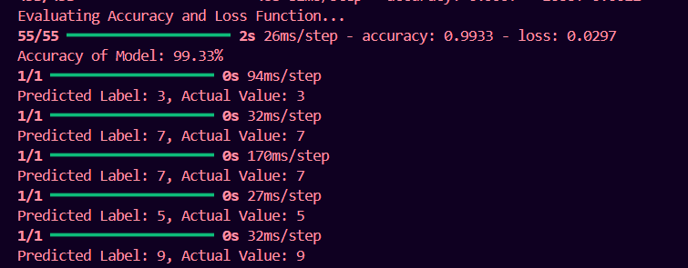

# Handwritten Digit Recognition using CNN

##  Project Overview
This project implements a Convolutional Neural Network (CNN) model to recognize handwritten digits (0–9) using the MNIST dataset. The model is trained to classify digit images with high accuracy.

---

##  Features
- Digit classification using Deep Learning
- CNN-based architecture
- Automatic dataset loading (MNIST)
- High accuracy (~99%)

---

##  Tech Stack
- Python
- TensorFlow / Keras
- NumPy
- OpenCV
- Scikit-learn

---

##  Model Performance
- Training Accuracy: ~99.9%
- Testing Accuracy: ~99.33%

---

##  Model Architecture
- 3 Convolutional Layers + ReLU Activation
- MaxPooling Layers
- Fully Connected Dense Layers
- Softmax layer for classification

---

## 📸 Output



### Sample Predictions:
- Predicted: 3 | Actual: 3  
- Predicted: 7 | Actual: 7  
- Predicted: 5 | Actual: 5  

---

## ▶️ How to Run

1. Clone the repository:
```bash
git clone https://github.com/Pauravi15/Handwritten-Digit-Recognition-DeepLearning.git
```
2. Navigate to project folder:
```bash
cd CNN_Keras
```
3. Install dependencies:
```bash
pip install -r requirements.txt
```
4. Run the model:
```bash
python CNN_MNIST.py
```
